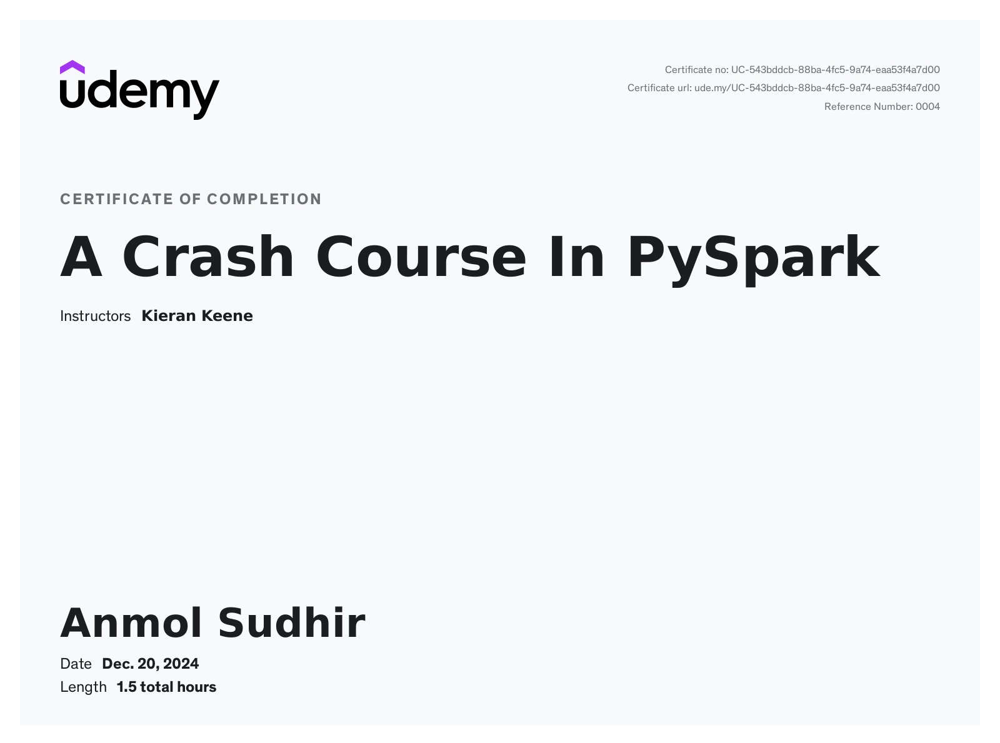

# Updates

## 20 December 2024

??? "Completed PySpark crash course."
    

??? "Read in depth about Data Lakehouse with Delta Lake"
    - Read about the architecture of Delta lake from the published paper of [Delta Lake](https://www.databricks.com/wp-content/uploads/2020/08/p975-armbrust.pdf).
    - Read about how it organizes data, how it maintains logs and how it enables ACID transactions on Data Lakes.
    - Read about how it optimizes the querying speed.

??? "Continued Tableau Course on Udemy"
    - Continued with learning Tableau from Udemy. Completed all the introductory lessons.

---

## 19 December 2024

??? "Created a visualization with Tableau"
    - Completed the exercise given by Sanjiv yesterday to create a "tree" like visualization of a sample datasets.
    - Created a dual axes visualization by making and using calculated fields.
    - One axis was represented as Bars and another as Circle to make the graph look like "Tree"

??? "Revised PySpark from Udemy course."
    - Revisited PySpark basics and refreshed the concepts.

??? "Continued learning hands-on Databricks from Udemy"
    - Completed 3 more lessons on Databricks using Databricks Community edition.

---

## 18 December 2024

??? "Solved more problems from leetcode SQL 50"
    - Solved the following SQL problems:
        - [2356. Number of Unique Subjects Taught by Each Teacher](https://leetcode.com/problems/number-of-unique-subjects-taught-by-each-teacher/?envType=study-plan-v2&envId=top-sql-50)
        - [1141. User Activity for the Past 30 Days I](https://leetcode.com/problems/user-activity-for-the-past-30-days-i/?envType=study-plan-v2&envId=top-sql-50)
??? "Read about InnoDB Locking and concurrency control mechanisms"
    - Learnt about locking mechanisms such as:
        - Optimistic and Pessimistic locking
        - 2-Phase Locking
        - Shared Locks and Exclusive locks
        - Row level, table level locking
        - Concurrency control using Transactions

??? "Learnt hands-on Databricks from Udemy"
    - Learnt Databricks from Udemy course I've enrolled in to prepare for Databricks Associate Data Engineer.
    - Completed 6 lessons on Databricks using Databricks Community edition.

??? "Learnt Tableau from Udemy"
    Learnt and followed along with Udemy course for Tableau.

??? "Attended the 2nd Tableau KT session"
    - Attended 2nd Tableau KT session organized by Sanjiv.
    - Learnt concepts such as:
        - Datatypes, difference between continuous and discrete datatypes. 
        - Multi axes plots.
        - Worksheet basics, workbooks and more.
        - Constant, Average, Forecast lines.
        - Conversion between discrete and continuous datatypes.

---

## 17 December 2024

??? "Continued learning MySQL on Udemy"
    Continued and followed along with the MySQL udemy course.

??? "Learnt date, time, datetime data types of MySQL"
    - Got a complete guide on how to manipulate date-time data type in MySQL.
    - Learnt how to format, find range, calculate difference between date data type.

??? "Practiced SQL on leetcode"
    Solved 4 more SQL problem on the Leetcode's SQL 50 list

> I've been learning SQL to get the [MySQL certification](https://education.oracle.com/mysql-80-database-developer-oracle-certified-professional/trackp_MYSQLPRG80OCP) from Oracle. 

---

## 16 December 2024

??? "Practiced *Window Functions of MySQL*"
    - Learnt and practiced MySQL window functions from the udemy the course.

??? "Learnt about *MS ADO, Jira* through a workshop organized by Tredence"
    - Attended a workshop organized by Tredence Agile CoE team on work management tools such as Jira, Azure DevOps.
    - Leant about MS ADO to manage agile workflow, and got a demo on how to use MS ADO.
    - I have experience with Jira so I was able to grasp all of the concepts that was taught.

??? "Attended *KT session on Tableau by Sanjiv Prasath*"
    - Sanjiv Prasath organized a KT session on Tableau. 
    - He introduced Tableau with a sample dataset and taught concepts such as:
        - Connecting/loading dataset in different ways.
        - Checking dataset schema, data types of coloums, dimentions, measures, strings and more.
        - Creating different charts using the dataset.
        - difference between logical and physical layer of Tableau.

??? "Practiced *Problems on SQL Subqueries* on leetcode"
    Practiced SQL subqueries that included joins, aggregate functions and more.

---

## 13 December 2024

??? "Practiced SQL - leetcode"
    Practiced more SQL from leetcode's SQL 50 list. Trying to complete the list by next week.

??? "Explored a DE project on github"
    - Discovered and explored a data engineering [project](https://github.com/nadyinky/ny_taxi_rides) on GitHub.
    - The project works on the NYC Yellow and Green Taxi dataset.
    - The stack for the project was
        - Apache Airflow
        - Google BigQuery
        - dbt
        - Google Looker for BI tasks.
    - I will clone this project and try to run it to learn more from it.

??? "Studied from the Udemy courses for certifications"
    - Watched and followed the tutor for hands on practice on the udemy courses that I've enrolled in to.
    - Re-read and understood the basics of PySpark, Databricks and more

> Did not do a lot today, but would cover up for some things this weekend.

---

## 12 December 2024

??? "Practiced SQL on leetcode"
    - Practiced SQL questions on JOINS, AGGREGATES and SUBQUERIES from leetcode's SQL 50 list.
    - I have been feeling more and more confident and comfortable writing SQL queries as I continue solving leetcode SQL problems.

??? "Enrolled on to Udemy courses to prepare for various certifications"
    - I have gained a taste of what data engineering is with into to various technologies such as Databricks, Snowflake, PySpark, Tableau, Google BigQuery, Apache Airflow and more.
    - And have decided to prepare for a few certifications such as:
        - SQL certification
        - Google Cloud Certified Data Engineer
        - Databricks Certified Data Engineer

??? "Explored Databricks community edition"
    Signed up for and explored Databricks community edition and tried out spark cluster hosted by Databricks.

??? "Read about Data Lakehouse"
    As part of my exploration of Databricks, I read about Data Lakehouse, gaining insights on why they exist, what problems they solve and what features they offer.

> Also create a simple website to update daily about my learnings

---

## 11 December 2024

??? "Practiced some more SQL on leetcode"
    I continued solving SQL problems to strengthen my understanding of query writing and optimization.

??? "Learnt fundamentals of dbt core for data transformation in the data warehouse"
    Explored dbt Core and its use for managing transformations in modern data warehouses.

??? "Learnt Apache airflow for batch workflow orchestration"
    Gained insights into Apache Airflow's DAG-based approach to orchestrating workflows and pipelines.

??? "Read more about pyspark RDD and Dataframes"
    Understood Spark Context, Spark Architecture, and how Spark integrates with various resource managers for cluster operations.

??? "Setup my development environment again in WSL"
    Configured my dev environment on WSL for a more comfortable Linux-based workflow.

---

## 10 December 2024

??? "Practiced SQL on leetcode"
    Worked on SQL problems to further refine query optimization skills.

??? "Learnt fundamentals of spark using pyspark locally with docker"
    Experimented with PySpark and Docker to get hands-on experience with Spark locally.

??? "Leant databricks"
    Started learning about Databricks but couldn’t fully explore due to the free trial activation pending.

??? "Got myself introduced to Tableau"
    Began exploring Tableau for data visualization and creating dashboards.

??? "Read about data engineering lifecycle"
    Studied the data engineering lifecycle from the book *Fundamentals of Data Engineering* by Joe Reis & Matt Housley.

---

## 9 December 2024

??? "Learning new concepts"
    - Got introduced to:
        - SQL window functions
        - Google BigQuery
        - Databricks
        - Snowflakes

    - Read about:
        - Internals of MySQL: query parser, query optimizers, and executors
        - InnoDB: the default storage engine of MySQL, B/B+ Tree Indexing

??? "Explored GCP"
    Having experience with AWS, I was able to grasp GCP concepts quickly.

??? "Improved git log info extraction"
    - Added CSV and Parquet export format support.
    - Implemented a method to upload exported data (CSV, Parquet) to Google Cloud Storage. (Still needs debugging.)
    - Using Google Cloud Storage as a data lake for storing raw git log data.

---

## 8 December 2024

??? "Worked on a small application"
    Created an application to extract commit logs from a git repository and load the data into an SQL database.

??? "Started a data engineering project"
    - Extracting commit info from git repositories.
    - Processing and analyzing commit data.
    - Visualizing the results on a dashboard.

    This project involves tools and technologies like:
    - SQL, Python, NumPy, Pandas
    - Databricks, Snowflake
    - BI tools like Tableau/Power BI
    - dBT, AWS/GCP (for additional learning)

??? "Planning daily progress automation"
    Using the smaller variant of this project, I plan to:
    - Extract daily commit information.
    - Send automated emails showing my daily progress based on commits as proof of work.

??? "Dived deeper into SQL"
    - Learned about Common Table Expressions (CTEs), PIVOT, UNPIVOT.
    - Understood the differences between Views and CTEs.
